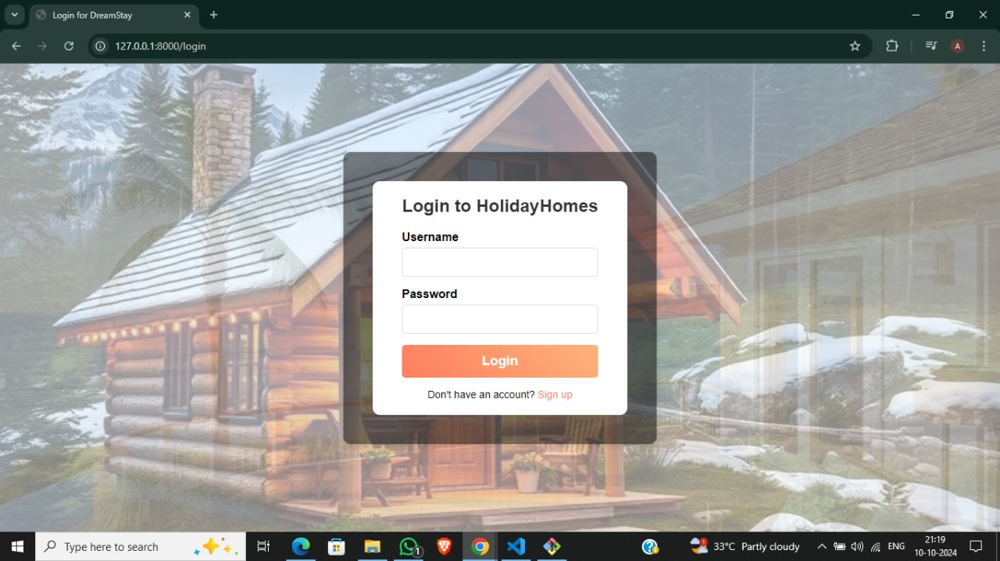
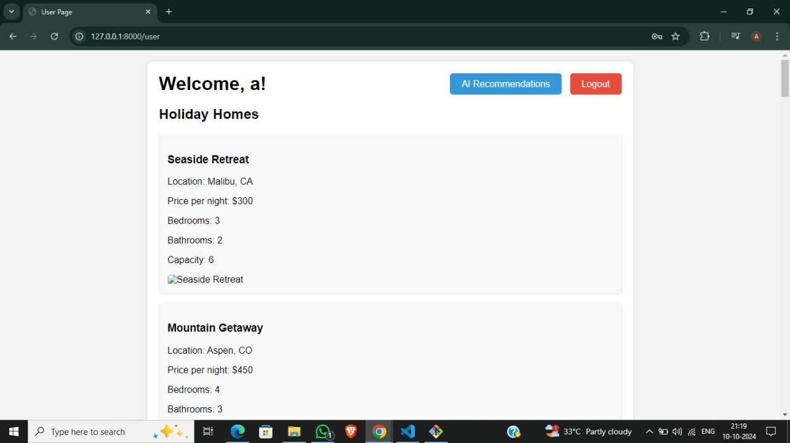
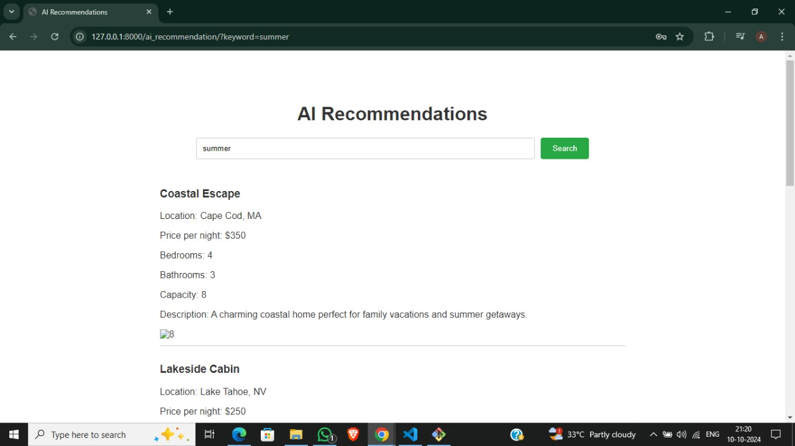

# Vacation Home Recommendation System

## Overview

The Vacation Home Recommendation System is a web application that helps users find holiday homes based on their preferences. Users can search for vacation homes by keywords, and the system will recommend properties that match their criteria using an AI-powered recommendation engine.

## Features

- *User Authentication*: Users can register and log in to access personalized features.
- *Search Functionality*: Users can search for vacation homes by typing keywords (e.g., "swimming", "beach").
- *AI Recommendations*: The system provides recommendations based on user input using a machine learning model.
- *User Dashboard*: A user-friendly dashboard displays the user's username, a logout button, and a list of recommended vacation homes.

## Tech Stack

- *Frontend*: HTML, CSS
- *Backend*: Django (Python framework)
- *Database*: SQLite (or PostgreSQL for production)
- *Machine Learning*: Scikit-learn, Pandas, NumPy for the recommendation engine
- Screenshots

Homepage:

Login Page:

Dashboard:

AI Webpage:

